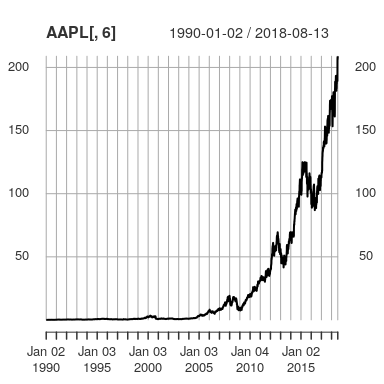
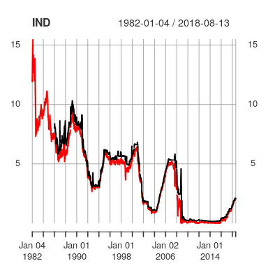

Financial Simulation: `quantmod` R package
================
Majeed Simaan
March 27th, 2018

Introduction
------------

In this vignette, I provide a brief introduction to the `quantmod` package to download stock prices, option prices, and different indices data.

Downloading Stock Prices from Yahoo Finance
-------------------------------------------

#### Loading the library

To get started, make sure you have installed the `quantmod` in R - you can do so using the following command:

``` r
install.packages("quantmod")
```

After successfully installing the package, you can load the package

``` r
library(quantmod)
```

#### Single stock example

To get started, assume that you are interested in downloading the stock prices for Apple ("AAPL"). To do so, you can easily get the data using the following command

``` r
getSymbols("AAPL",from = "1990-01-01")
```

    ## [1] "AAPL"

Note that getSymbols takes two inputs above. The first one is the ticker of the stock, whereas the second is the start date. In case there is no data prior to the inputted date, the function will return the maximum date. Also, note that R stores the stock data in a new item named `AAPL`. For instance,

``` r
head(AAPL)
```

    ##            AAPL.Open AAPL.High AAPL.Low AAPL.Close AAPL.Volume
    ## 1990-01-02  1.258929  1.339286 1.250000   1.330357    45799600
    ## 1990-01-03  1.357143  1.357143 1.339286   1.339286    51998800
    ## 1990-01-04  1.366071  1.383929 1.330357   1.343750    55378400
    ## 1990-01-05  1.348214  1.366071 1.321429   1.348214    30828000
    ## 1990-01-08  1.339286  1.357143 1.321429   1.357143    25393200
    ## 1990-01-09  1.357143  1.357143 1.321429   1.343750    21534800
    ##            AAPL.Adjusted
    ## 1990-01-02      0.122946
    ## 1990-01-03      0.123771
    ## 1990-01-04      0.124184
    ## 1990-01-05      0.124597
    ## 1990-01-08      0.125422
    ## 1990-01-09      0.124184

If one wishes to focus on the adjusted prices, which I will do in this article, one can do so by referring to the corresponding column number, i.e. `AAPL[,6]`. For instance, the following command plots the adjusted prices over time

``` r
plot(AAPL[,6])
```



#### Multiple Stocks

Now, let's assume we are interested in downloading data for multiple tickers stacked in vector `tics`, where

``` r
tics <- c("AAPL","GE","TWTR","BAC","RAD","PFE")
```

One approach is to run a loop and get the data for each ticker, and then try to figure out a way to merge the prices altogether. Instead, I would like to show you the following trick using Functional Programming:

``` r
P.list <- lapply(tics, function(tic) get(getSymbols(tic, from = "1980-01-01")) )
```

Note that the `P.list` is a list object containing the data for each ticker. In total, it contains 6 elements (corresponding to the number of tickers), while the each element has the following length

``` r
sapply(P.list, nrow)
```

    ## [1] 9499 9739 1199 9687 8484 9739

Obviously, `TWTR` has the least number of dates in the time series. Merging the adjusted prices altogether is straightforward

``` r
P.adj <- lapply(P.list, function(p) p[,6] ) # pulls the sixth column of each ticker
P <- Reduce(merge,P.adj) # merge altogether  
names(P) <- tics # adjust the names with respect to the tickers
head(P,2) # returns the oldest two observations
```

    ##            AAPL       GE TWTR BAC RAD      PFE
    ## 1980-01-02   NA 0.005311   NA  NA  NA 0.000712
    ## 1980-01-03   NA 0.005379   NA  NA  NA 0.000712

``` r
tail(P,2) # returns the most recent two observations
```

    ##              AAPL    GE  TWTR   BAC  RAD   PFE
    ## 2018-08-10 207.53 12.77 32.01 31.19 1.48 40.93
    ## 2018-08-13 208.87 12.45 32.80 30.48 1.40 40.81

Finally, to get the returns, I use the `lag` operator, such that

``` r
R <- P/lag(P) - 1 # or log(P/lag(P))
```

Note that since each ticker has a different length, the combined returns have a lot of missing values. One can either drop the missing values using the `na.omit` function or utilize all data to derive the relevant estimates. In the latter case, one can compute the mean vector and the covariance matrix using all available information as follows

``` r
M <- apply(R,2,function(x) mean(x,na.rm = T)  )
S <- var(R,use = "pairwise")
```

Finally, you can save the data into a csv file. **But**, make sure that data is saved as a `data.frame` rather than an `xts` object, i.e.

``` r
write.csv(data.frame(R),file = "R.csv")
```

Downloading Options Data from Yahoo Finance
-------------------------------------------

The `quantmod` package also allows users to download options data from Yahoo, however, this is more tricky. The main function I will use is the `getOptionChain` from the `quantmod` package. Like `getSymbols`, `getOptionChain` requires ticker as the main input. However, the function does not return any historical options data. The second argument one can add is the expiration date. If one knows the exact expiration date, then it is straightforward to implement. If not, one can either search for the expiration dates from Yahoo Finance or explore expiration as I will illustrate below.

#### Let's get started

To get started, let's pull some options data for Apple:

``` r
opt <- getOptionChain("AAPL",Exp = "2018")
class(opt)
```

    ## [1] "list"

``` r
names(opt)
```

    ##  [1] "Aug.17.2018" "Aug.24.2018" "Aug.31.2018" "Sep.07.2018" "Sep.14.2018"
    ##  [6] "Sep.21.2018" "Sep.28.2018" "Oct.19.2018" "Nov.16.2018" "Dec.21.2018"

As you can see, the names of the lists are assigned with respect to the expiration date for the year 2018. Let's assume that we are interested in options expiring in six months ahead. In this case, "Sep.21.2018" is the most relevant one.

``` r
opt6 <- opt[["Sep.21.2018"]]
class(opt6)
```

    ## [1] "list"

``` r
names(opt6)
```

    ## [1] "calls" "puts"

Note that the `opt6` is also a list, where each item in the list corresponds to the call and put options data, such that

``` r
sapply(opt6, class)
```

    ##        calls         puts 
    ## "data.frame" "data.frame"

To put altogether, I perform the following commands

``` r
opt6 <- lapply(1:length(opt6), function(i) data.frame(opt6[[i]],Type = names(opt6)[i],  Expiration =  "Sep.21.2018" , stringsAsFactors = F) )
opt6 <- Reduce(rbind,opt6)
```

The first line adds one column corresponding to the type of the option and another for the expiration date. The second line combines the two lists altogether by rows as one `data.frame`, i.e.

``` r
class(opt6)
```

    ## [1] "data.frame"

Finally, I would like to adjust the expiration date format and add today's date to the data:

``` r
opt6$Expiration <- as.Date(opt6$Expiration,format='%B.%d.%Y')
opt6$Date <- Sys.Date()
head(opt6)
```

    ##                     Strike   Last    Chg    Bid    Ask Vol OI  Type
    ## AAPL180921C00070000     70 139.57   0.00 137.40 138.20 105  0 calls
    ## AAPL180921C00075000     75 115.07 115.07 115.50 116.50   0  0 calls
    ## AAPL180921C00080000     80 129.60   0.00 127.45 128.20  74 20 calls
    ## AAPL180921C00085000     85 122.50   0.00 122.50 123.20   2  0 calls
    ## AAPL180921C00090000     90 118.90   0.00 117.50 118.20  48  2 calls
    ## AAPL180921C00095000     95 113.85   0.00 112.50 113.25  40  1 calls
    ##                     Expiration       Date
    ## AAPL180921C00070000 2018-09-21 2018-08-14
    ## AAPL180921C00075000 2018-09-21 2018-08-14
    ## AAPL180921C00080000 2018-09-21 2018-08-14
    ## AAPL180921C00085000 2018-09-21 2018-08-14
    ## AAPL180921C00090000 2018-09-21 2018-08-14
    ## AAPL180921C00095000 2018-09-21 2018-08-14

#### Generalization

The above illustration focuses on one stock and one expiration date. To generalize, let's consider a function that takes one ticker as the main input and returns a `data.frame` object that covers all options data today for all expiration dates.

``` r
get_opt <- function(tic) {
  OPT <- numeric()
  opt.i <- try(getOptionChain(tic,Exp = NULL), silent = T )
      if(inherits(opt.i, "try-error"))
          return(NULL) 
    
      else {
    
        # drop any missing 
        opt.i <- opt.i[!sapply(opt.i, function(x) any(sapply(x, is.null   )) )]
        exp.time <- names(opt.i)
        opt.iy <- numeric()
            for(exp_t in exp.time) {
              opt.it <- opt.i[[exp_t]]
              opt.it <- lapply(1:length(opt.it), function(i) 
                data.frame(opt.it[[i]],Type = names(opt.it)[i],  
                Expiration =  exp_t , stringsAsFactors = F) )
              opt.it <- Reduce(rbind,opt.it)
              opt.it$Expiration <- as.Date(opt.it$Expiration,format='%B.%d.%Y')
              opt.it$Date <- Sys.Date()
              opt.iy <- rbind(opt.iy,opt.it)
            }
        OPT <- rbind(OPT,opt.iy)
        OPT$Ticker <- tic
        rownames(OPT) <- NULL
        }
    
  return(OPT)
} 
```

Let's run the `get_opt` function on all tickers we have in `tics`:

``` r
opt.list <- numeric()
for(i in 1:length(tics)) {
  get.i <- try(get_opt(tics[i]),silent = T)
    if(inherits(get.i, "try-error"))
       opt.list[i] <- list(NULL)
    else
  opt.list[i] <- list(get.i)
}
names(opt.list) <- tics
sapply(opt.list,nrow) # number of observations in each data
```

    ## AAPL   GE TWTR  BAC  RAD  PFE 
    ## 1178  414  886  609  116  431

The above tries to extract all options data for a set of tickers. In case there is a failure, the list assigns an empty object. As a final step, we can combine all items in the `opt.list` by rows as we did earlier

``` r
opt.ds <- Reduce(rbind,opt.list)
write.csv(opt.ds,file = "OPT.csv",row.names = FALSE)
```

Downloading Indices and Economic Indicators from FRED
-----------------------------------------------------

To download other indices outside Yahoo Finance, especially economic indicators, I recommend the Federal Reserve Economic Data [FRED](https://fred.stlouisfed.org/) as the best open source to establish so. Let's say that you already know the tickers (codes) names you interested in, then getting these indices is as simple as getting stock data from Yahoo Finance. Nonetheless, I recommend browsing through the FRED website to figure out which code you are looking for. For instance, the corresponding codes for the LIBOR and 3-months Treasury maturity rates are given by `"USD1MTD156N"` and `"DGS3MO"`, respectively.

``` r
indices <- c("USD1MTD156N","DGS3MO")
ind.list <- lapply(indices, function(tic) get(getSymbols(tic, from = "1980-01-01", src = "FRED")) )
IND <- Reduce(merge,ind.list)
```

Different from the stock returns, I changed the `src` to `FRED`, whereas the default is set to `src = "yahoo"`.

``` r
plot(IND)
```



Finally, don't forget to save the `IND` into a csv by transforming into a `data.frame`:

``` r
write.csv(data.frame(IND),file = "IND.csv")
```
